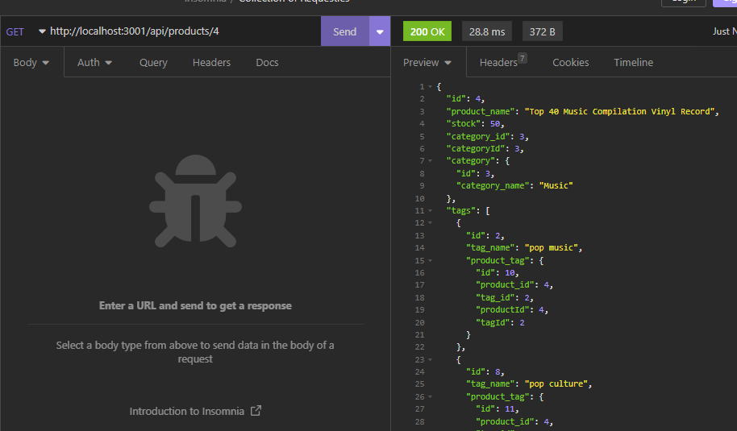

# Server Side E Commerce

## Description

This project was created to create routes and a database for an E Commerce store. The purpose of this project was to utilize sequelize as an ORM for our database.

## Table of Contents

- [Installation](#installation)
- [Usage](#usage)
- [License](#license)
- [Contribute](#contribute)
- [Tests](#tests)
- [Questions](#questions)

## Installation

To install this application, first clone the github repository from [this link](https://github.com/blaubachs/server-side-e-commerce.git). Then, navigate to the directory created by it, run the following commands.

- 1. "npm install"
- 2. Move to the db folder, and create the database on your machine locally. This can be run with "source schema.sql" once logged into MySQL.
- 3. Move back to the root folder.
- 4. "npm run seed"
- 5. "npm run start"

## Usage

To use this application, you are able to make api calls using the routes starting with the prefix "/api".
This API has full capability for get, post, put, and delete requests. 

## License

Please refer to the MIT License for licensing information.

## Contribute

N/A

## Tests

N/A

## Questions

Github: [blaubachs](https://github.com/blaubachs)

Contact: No contact information provided.

---

